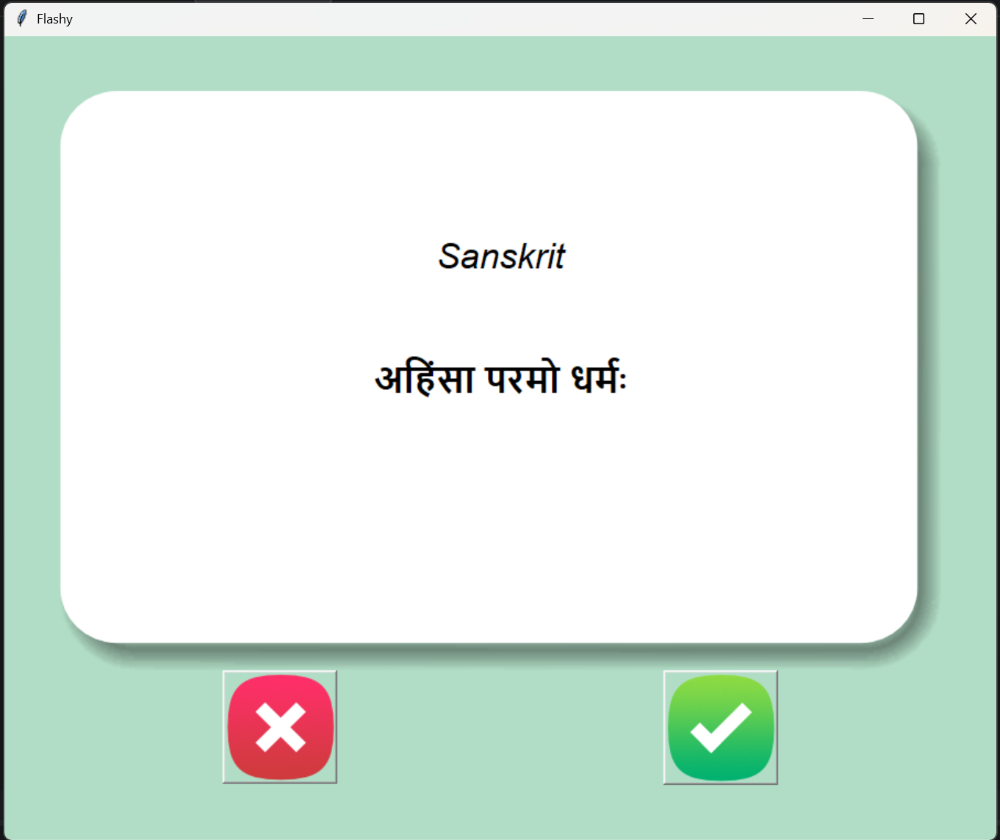

<h1 align="center">🪔 Sanskrit Flashcard App</h1>
<p align="center">
Learn Sanskrit the interactive way with Sudin.
</p>

A desktop flashcard application built with **Python + Tkinter** to help users learn Sanskrit vocabulary through interactive flashcards.

---

<p align="center">
  
  
  
</p>

---

## ✨ Features

✔ Loads Sanskrit–English word pairs from CSV  
✔ Automatically flips cards after 3 seconds  
✔ Tracks learned words  
✔ Saves progress automatically  
✔ Clean and minimal GUI  

---

## 🖼 Application Preview


>

>
---

## 🛠 Technologies Used

- 🐍 Python

- 🖼 Tkinter (GUI Framework)

- 📊 Pandas (CSV handling)

- 🎲 Random module

---

## 📂 Project Structure

```bash
flash-card-project-start/
│
├── data/
│ ├── sanskrit_words.csv
│ └── words_to_learn.csv (auto-generated)
│
├── images/
│ ├── card_front.png
│ ├── card_back.png
│ ├── right.png
│ └── wrong.png
│
├── README.md
└── main.py
```
---
## ▶ How to Run

1. Install dependencies:
```
pip install pandas
```

2. Run the program:
```
python main.py
```
---
## 📖 How It Works

- A random Sanskrit word is selected from the dataset.
- After 3 seconds, the card flips to reveal the English meaning.
- If the word is known, it is removed from the learning list.
- Progress is saved automatically.

---

## 🎯 Future Improvements

- Add pronunciation audio
- Add difficulty levels
- Add more datasets
- Improve UI styling

---

Created as part of a Python learning project.

<h2 align="center">कथा अनन्ता…</h2>
<h3 align="center">अग्रे प्रकाशः भविष्यति</h3>
<p align="center"><i>The story is infinite… Light awaits ahead.</i></p>


